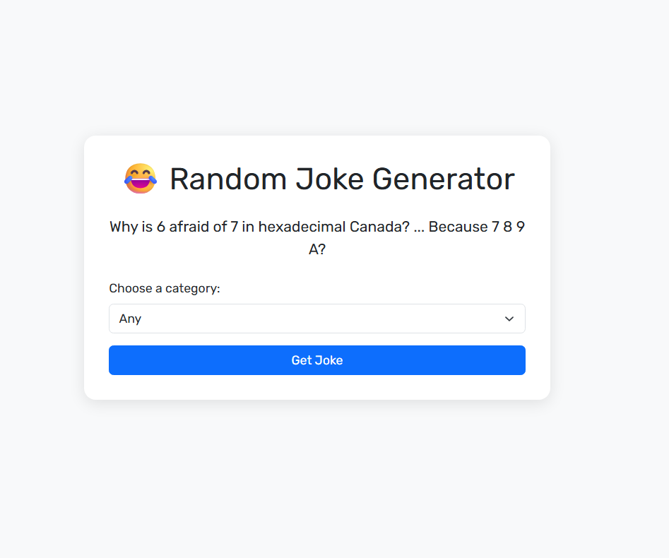

<p align="center">

</p>

#  Joke Generator App
A simple and fun Node.js web application that fetches random jokes using the [JokeAPI](https://jokeapi.dev/) and displays them in a clean, responsive interface.


---

##  Live Preview (Optional)

> If deployed, you can add a link here.

---

##  Features

- Get a random joke on page load
- Choose from multiple categories (Programming, Dark, Pun, etc.)
- Responsive and beautiful design with Bootstrap 5
- Error handling if API call fails


---

## 🛠️ Tech Stack

- Node.js
- Express.js
- EJS (Embedded JavaScript Templates)
- Bootstrap 5
- JokeAPI (REST)

---

##  Installation

1. Clone the repository:

```bash
git clone https://github.com/YOUR_USERNAME/joke-generator-nodejs.git
cd joke-generator
```

2. Install dependencies:
```bash
npm install
```

3. Run the app:
```bash
node index.js
# or
#nodemon index.js
```